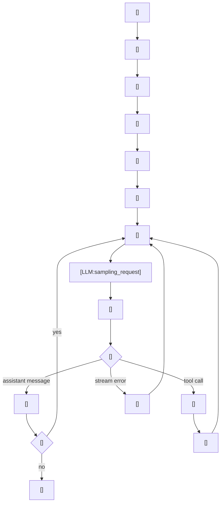

---
prompts:
  base_instructions:
    path: codex-rs/protocol/src/prompts/base_instructions/default.md
    description: "Codex の共通基底指示"
  permissions:
    path: codex-rs/prompts/templates/permissions/approval_policy/on_request.md
    description: "実行権限と承認方針をモデルに伝える基本指示"
  sandbox_mode:
    path: codex-rs/prompts/templates/permissions/sandbox_mode/workspace_write.md
    description: "サンドボックスの書き込み範囲を説明する指示"
  collaboration_mode:
    path: codex-rs/core/src/context/collaboration_mode_instructions.rs
    description: "コラボレーション設定の開発者指示"
  realtime_start:
    path: codex-rs/prompts/templates/realtime/realtime_start.md
    description: "リアルタイム会話が有効な開始状態を示す指示"
  realtime_end:
    path: codex-rs/prompts/templates/realtime/realtime_end.md
    description: "リアルタイム会話が終了した状態を示す指示"
  model_switch:
    path: codex-rs/core/src/context/model_switch_instructions.rs
    description: "前回とモデルが違うときにだけ足す補足指示"
  personality:
    path: codex-rs/core/src/context/personality_spec_instructions.rs
    description: "ユーザーが選んだ話し方や性格を反映する指示"
  apps:
    path: codex-rs/core/src/context/apps_instructions.rs
    description: "利用可能な Connector アプリの使い方を示す指示"
  skills:
    path: codex-rs/core/src/context/available_skills_instructions.rs
    description: "利用可能な skills の扱いと参照手順を示す指示"
  plugins:
    path: codex-rs/core/src/context/available_plugins_instructions.rs
    description: "利用可能な plugin capabilities の説明文"
  token_budget:
    path: codex-rs/core/src/context/token_budget_context.rs
    description: "残りトークンと自動コンパクションの見込みを知らせる指示"
commands:
  - name: implicit_submit_turn
    path: codex-rs/core/src/session/mod.rs
    description: "通常の送信で turn を開始し、実行ループを回す"
  - name: implicit_retry
    path: codex-rs/core/src/session/turn.rs
    description: "ストリーム再試行で同じ turn を継続する"
call_points:
  - path: codex-rs/core/src/context/world_state/agents_md.rs
    line: 27
    description: "workspace policy fragment を model-visible fragment に変える"
  - path: codex-rs/ext/skills/src/render.rs
    line: 17
    description: "skills fragment を整形する"
  - path: codex-rs/core/src/session/mod.rs
    line: 3158
    description: "turn の initial context を組み立てる入口"
  - path: codex-rs/core/src/session/mod.rs
    line: 3237
    description: "collaboration_mode を developer context に積む"
  - path: codex-rs/core/src/session/mod.rs
    line: 3288
    description: "skills を model-visible context に積む"
  - path: codex-rs/core/src/session/mod.rs
    line: 3333
    description: "plugins の説明を developer context に積む"
  - path: codex-rs/core/src/session/mod.rs
    line: 3403
    description: "token budget の補助 context を積む"
  - path: codex-rs/core/src/session/turn.rs
    line: 128
    description: "1 turn の実行ループの役割を定義する"
  - path: codex-rs/core/src/session/turn.rs
    line: 1072
    description: "sampling request を送って tool call と assistant message を回す"
  - path: codex-rs/core/src/stream_events_utils.rs
    line: 190
    description: "完了した assistant / tool output を履歴へ確定する"
---

# LLM 実行ループ

このワークフローは、1 回の会話 turn を起点に、まず必要な context と prompt 資産を集めて LLM サーバーへ request を送り、tool call と履歴更新を挟みながら応答完了まで回すかを説明する。

## 使われる場面

- 通常の `/submit` 相当の送信が来たとき
- 送信後に model の follow-up が必要になったとき
- tool call を実行して次の sampling request を出すとき
- コンパクションや retry で同じ turn を再度回すとき

## 入出力

- 入力
  - `TurnContext`
  - `WorldState`
  - `McpRuntimeSnapshot`
  - 前回のターン設定や各種 feature flag
- 出力
  - streaming される `ResponseEvent`
  - 履歴に確定された assistant / tool / reasoning の `ResponseItem`
  - turn の完了結果としての `last_agent_message`

## 全体像



この図は、会話 turn の先頭で前回 turn との差分を積み、その後に初期文脈と prompt 資産を材料化して LLM request を送り、応答・tool・error の分岐を回しながら 1 turn を確定する流れを示す。

## プロンプト要約

この turn では、`base_instructions` を土台にして、次の prompt 資産を順番に材料化する。

### `base_instructions`

- Codex CLI のエージェントであること、対応範囲、応答の簡潔さを述べる。
- Personality では、 concise / clear / efficient / friendly を軸にする。
- How you work では、preamble、planning、task execution、validation の進め方を説明する。
- 作業方針を探索して従うこと、Responsiveness では前置きメッセージの出し方を述べる。
- User-facing line of communication として、回答を短く、次の作業を明確にする。

### `permissions`

- sandbox 外で動くコマンドは承認が要ること、コマンド列を独立セグメントに分けて判定することを説明する。
- `require_escalated` の付け方、`justification` の書き方、`prefix_rule` の考え方が書かれている。
- ネットワーク失敗や sandbox 関連失敗があれば、再実行時にどう扱うかを案内する。

### `sandbox_mode`

- `sandbox_mode` が `workspace-write` であること、編集できる範囲が `cwd` と `writable_roots` であることを述べる。
- ネットワークアクセスの有無も併記する。

### `collaboration_mode`

- collaboration mode に応じた developer 向けの追加指示を載せる。
- そのモードで有効な developer instructions をそのまま差し込む。

### `realtime_start` / `realtime_end`

- `Realtime conversation started.` と `Realtime conversation ended.` をそれぞれ返す。
- 開始時は transcript 前提、終了時は通常の typed text 前提に戻ることを示す。

### `model_switch`

- 以前は別のモデルを使っていたことを伝え、その続き方を指示する。
- `The user was previously using a different model...` で始まる補足が入る。

### `personality`

- ユーザーが選んだ communication style を future messages に反映する。
- playful / warm / witty / expressive など、会話の温度感を整える。

### `apps`

- `[$app-name](app://{connector_id})` 形式で app を呼べることを説明する。
- 使える app は MCP tools の束で、`tool_search` から見つかることを含む。
- 追加で `list_mcp_resources` や `list_mcp_resource_templates` を呼ばないことが書かれている。

### `skills`

- 利用可能な skill の前提と参照手順が書かれている。
- `How to use skills` の節が付くことがあり、参照方法の案内も含まれる。

### `plugins`

- plugin は skills / MCP servers / apps を束ねた local bundle だと説明する。
- skill naming、MCP naming、trigger rules、capability の見方が列挙される。

### `token_budget`

- thread id、first / current / previous context window id、残りトークンを知らせる。
- 必要なら `You have {tokens_left} tokens left...` のような補助文も付く。

## プロンプトの工夫

### 権限とサンドボックス

- `PermissionsInstructions` は 1 つの指示で終わらず、サンドボックス、承認方針、書き込み可能 root、拒否された read を段階的に積む。
- `approvals_reviewer = auto_review` のときは、追加の注意文を末尾に付ける。

### コラボレーションモード

- `developer_instructions` が空なら何も足さない。
- guardian 系のセッションでは、通常の developer bundle から分離して別メッセージにする。

### realtime start / end

- `realtime_active` が true なら開始文を出す。
- 開始時に追加指示があれば `realtime_start_with_instructions` を使う。
- 以前は有効で今は無効なら終了文を出す。
- これは turn 遷移の差分更新に含まれる、単なる mode 反映である。
- `pending_input` の drain や `record_pending_input` とは別経路で、realtime は turn 設定差分として扱う。

### 人格とモデル切り替え

- 人格は、モデル側に baked in されていない場合だけ外付けで送る。
- 以前とモデルが違うときだけ `ModelSwitchInstructions` を出す。

### Apps / Skills / Plugins

- Apps は enabled かつ accessible な connector があるときだけ入る。
- Skills は見えるものを render してから、使い方の案内を追加する。
- Plugins は loaded plugin の capability summary を説明する。
- 推薦 plugin は user 側の文脈に入る。これは「入れれば役に立つかもしれない」候補なので、実装可能な tool とは分ける。

### Token budget

- `TokenBudgetContext` は full-context のメタ情報として扱う。
- `ContextWindowGuidance` は任意の guidance message を追加するだけに留める。

## ループの分解

### 0. turn 遷移の差分を積む

- `record_context_updates_and_set_reference_context_item` が、前回の turn との差分を先に履歴へ積む。
- `build_settings_update_items` で、model switch / permissions / collaboration / multi-agent / realtime / personality の差分をまとめる。
- realtime の start / end は、この差分更新の一部として積まれ、独立ワークフローではない。
- `pending_input` の drain は別で、モデル実行中に届いた通常入力を回収するためのループ制御である。
- `realtime_active` の切り替えはこの差分更新で明示され、以後の prompt/handling が realtime 前提かどうかを決める。
- これは独立ワークフローではなく、次の sampling request に進む前の turn 進行の一部。

### 1. turn を開始する

- `run_turn` が最初の step を作る。
- `build_skills_and_plugins` で、ユーザー入力から明示された skill / plugin / app を注入する。

### 2. 1 回目の sampling request を送る

- `run_sampling_request` が `build_prompt` を呼び、現在の履歴と base instructions を model request に変換する。
- `try_run_sampling_request` が stream を読み、`ResponseEvent` を逐次返す。
- retry 可能な stream error は同じ prompt で再送する。

### 3. response を履歴に確定する

- assistant message が完了したら `record_completed_response_item` 系で履歴へ確定する。
- tool call が出たら tool runtime が実行し、その output を履歴へ戻す。
- `tool call -> output -> next sampling request` が 1 turn の中で繰り返される。

### 4. turn を終える

- model が追加の follow-up を必要としなければ turn を終える。
- stop hook や legacy after-agent hook があれば、終了直前に挟まる。
- 最後に `last_agent_message` が返り、上位レイヤーが完了判定に使う。

## Python 疑似コード

```python
def run_turn(workspace, config, turn_context, turn_input):
    turn_context_snapshot = collect_turn_context(workspace, turn_context)
    prompt_context = build_turn_prompt_context(workspace, config, turn_context_snapshot, turn_input)
    settings_update_items = build_settings_update_items(
        previous=workspace.reference_context_item(),
        previous_turn_settings=workspace.previous_turn_settings(),
        next=turn_context,
        exec_policy=workspace.exec_policy,
        personality_feature_enabled=workspace.features.personality,
    )
    if settings_update_items:
        record_turn_context(workspace, turn_context, settings_update_items)

    can_drain_pending_input = not turn_input

    while True:
        pending_input = workspace.pending_input() if can_drain_pending_input else []
        if record_pending_input(workspace, turn_context, pending_input):
            break

        workspace_prompt_context = build_turn_prompt_context(
            workspace=workspace,
            config=config,
            turn_context=turn_context_snapshot,
            turn_input=turn_input,
        )
        prompt = build_prompt(
            workspace_prompt_context,
            workspace.agents_md,
            turn_context_snapshot,
            workspace.history,
        )
        result = call_llm(
            prompt=prompt,
        )

        if result.stream_error:
            if result.retryable:
                continue
            return result

        if result.tool_call:
            tool_result = call_tool(result.tool_call)
            workspace.append_history(tool_result)
            can_drain_pending_input = True
            continue

        workspace.append_history(result.assistant_message)
        if result.needs_follow_up:
            can_drain_pending_input = True
            continue
        return result.last_agent_message
```

## 再実装の要点

1. このワークフローの主役は「初期文脈」ではなく「ループ」。
1. prompt 生成、stream 受信、tool 実行、履歴確定を分けて考える。
1. assistant message で終わる場合と、tool call で続く場合を別経路として書く。
1. retry と compaction は例外処理ではなく、ループの一部として扱う。
