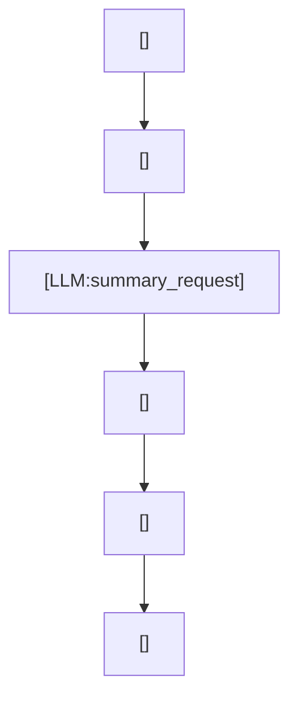

---
prompts:
  base_instructions:
    path: codex-rs/protocol/src/prompts/base_instructions/default.md
    description: "要約用 LLM が従う共通基底指示"
  summarize:
    path: codex-rs/prompts/templates/compact/prompt.md
    description: "会話履歴を短く要約するための指示文"
commands:
  - name: compact
    path: codex-rs/core/src/tasks/compact.rs
    description: "/compact に相当する手動コンパクションの入口"
  - name: implicit_auto_compact
    path: codex-rs/core/src/compact.rs
    description: "トークン上限接近時に自動でコンパクションを走らせる"
call_points:
  - path: codex-rs/core/src/tasks/compact.rs
    line: 28
    description: "手動コンパクションで local / remote を選ぶ"
  - path: codex-rs/core/src/compact.rs
    line: 91
    description: "自動コンパクション用の入力 prompt を作る"
  - path: codex-rs/core/src/compact.rs
    line: 322
    description: "履歴から要約用テキストと summary_prefix を作る"
  - path: codex-rs/core/src/compact.rs
    line: 360
    description: "圧縮後の履歴に置き換える"
---

# コンパクション

このワークフローは、コンパクション実行 turn の中で長くなった会話履歴を集めて要約 request を作り、短い要約に置き換えて次の推論を軽くする。  
ここで圧縮するのは会話履歴であって、作業方針そのものではない。

## 使われる場面

- 手動で `/compact` 相当の処理を走らせるとき
- 自動でトークン上限に近づいたとき
- 長い履歴を要約して次の会話 turn へ渡したいとき

## 入出力

- 入力
  - 既存の会話履歴
  - `SUMMARIZATION_PROMPT` または `compact_prompt`
  - 初期文脈の再注入条件
- 出力
  - `SUMMARY_PREFIX` 付きの要約
  - 置き換え後の履歴
  - 再計算された token usage

## 全体像



この図は、コンパクション turn の中で履歴と要約用の prompt 資産を集め、その request を LLM サーバーへ送って summary に置き換え、次の会話 turn へ渡す流れを示す。

## プロンプト要約

この処理では、会話履歴を要約して、次の LLM request に渡しやすい形にする。

### `base_instructions`

- Codex CLI の基本姿勢を持ち込む。
- 要約でも、普段の応答基準を崩さない。

### `summarize`

- `CONTEXT CHECKPOINT COMPACTION` の handoff summary を作る。
- Current progress, key decisions, important context, constraints, what remains, critical data を含める。
- concise and structured に、次の LLM が task を seamless に引き継げるようにする。

## プロンプトの工夫

### `SUMMARIZATION_PROMPT`

- `CONTEXT CHECKPOINT COMPACTION` を指示する合成プロンプト。
- 別の LLM に渡す handoff summary を作るよう求める。
- current progress, key decisions, important context, constraints, remaining work, critical data を含める。

### `SUMMARY_PREFIX`

- 要約本文の手前に付ける固定マーカー。
- 圧縮済み履歴の中で summary を見分ける境界として使う。

### `compact_prompt` の上書き

- config に `compact_prompt` があればそちらを優先する。
- それが空なら default の `SUMMARIZATION_PROMPT` を使う。

## Python 疑似コード

```python
def call_compaction_workflow(workspace, config, history_context):
    if config.use_manual_compaction:
        return call_manual_compaction(workspace, history_context)

    if config.use_remote_compaction:
        return call_remote_compaction(workspace, config, history_context)

    prompt_context = build_compaction_prompt_context(config, history_context)
    prompt = build_prompt(prompt_context, workspace.agents_md, history_context, config)
    result = call_llm(prompt=prompt)

    if result.stream_error:
        return result

    summary_context = build_summary_context(result.text)
    workspace.replace_history(merge_summary_into_history(history_context, summary_context))
    return result.text
```

## 再実装の要点

1. summary は履歴の一部として保存する。
1. ただ短くするだけではなく、次の会話 turn の再開に耐える形で置き換える。
1. 自動コンパクションは、初期文脈の再注入条件を忘れない。
1. manual / auto / local / remote の入口差を分けて考える。
