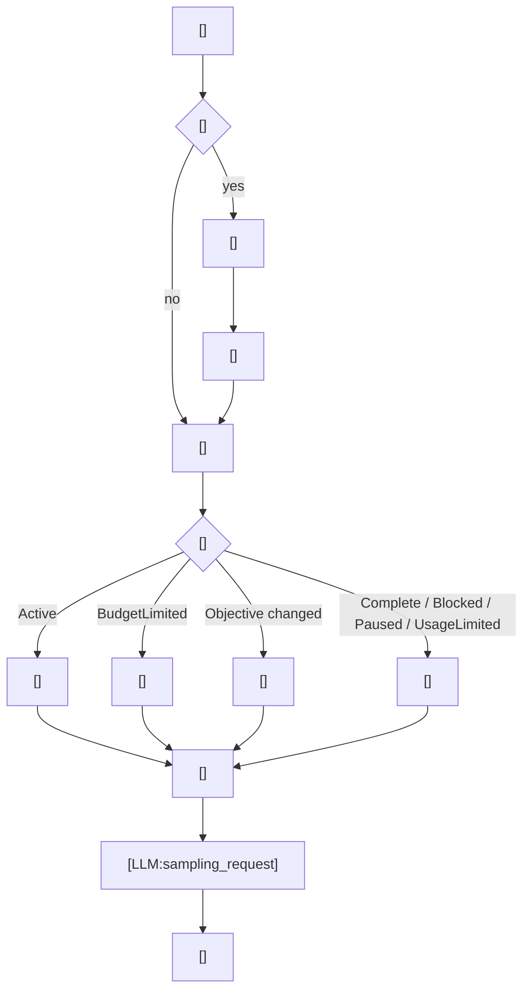

---
prompts:
  continuation:
    path: codex-rs/prompts/templates/goals/continuation.md
    description: "アクティブなゴールを次の会話 turn へ継続させる指示"
  budget_limit:
    path: codex-rs/prompts/templates/goals/budget_limit.md
    description: "予算を使い切ったときに終了へ向けてまとめる指示"
  objective_updated:
    path: codex-rs/prompts/templates/goals/objective_updated.md
    description: "ユーザーがゴールを書き換えたときの差し替え指示"
commands:
  - name: goal
    path: codex-rs/ext/goal/src/tool.rs
    description: "/goal で goal の作成・更新・完了を受け付ける"
  - name: implicit_goal_turn
    path: codex-rs/ext/goal/src/runtime.rs
    description: "active goal を idle 時に新しい会話 turn へ継続させる"
call_points:
  - path: codex-rs/ext/goal/src/extension.rs
    line: 102
    description: "thread 開始時に goal runtime を初期化する"
  - path: codex-rs/ext/goal/src/extension.rs
    line: 139
    description: "thread 再開時に goal runtime を復元する"
  - path: codex-rs/ext/goal/src/extension.rs
    line: 154
    description: "idle thread で goal の継続を試みる"
  - path: codex-rs/ext/goal/src/extension.rs
    line: 201
    description: "会話 turn 開始時に active goal を turn accounting に結び付ける"
  - path: codex-rs/ext/goal/src/extension.rs
    line: 243
    description: "会話 turn 終了時に goal progress を清算する"
  - path: codex-rs/ext/goal/src/extension.rs
    line: 271
    description: "会話 turn 中断時に goal progress を清算する"
  - path: codex-rs/ext/goal/src/extension.rs
    line: 299
    description: "会話 turn エラー時に goal を停止状態へ寄せる"
  - path: codex-rs/ext/goal/src/extension.rs
    line: 359
    description: "tool 完了後の同じ会話 turn に budget 限界 steering を注入する"
  - path: codex-rs/ext/goal/src/tool.rs
    line: 151
    description: "goal の get / create / update tool を実行する"
  - path: codex-rs/ext/goal/src/api.rs
    line: 75
    description: "外部 goal set の runtime effect を反映する"
  - path: codex-rs/ext/goal/src/runtime.rs
    line: 159
    description: "外部 goal set を runtime に適用する"
  - path: codex-rs/ext/goal/src/runtime.rs
    line: 243
    description: "エラーや usage limit で active goal を停止する"
  - path: codex-rs/ext/goal/src/runtime.rs
    line: 359
    description: "idle thread に continuation steering を差し込む"
  - path: codex-rs/ext/goal/src/steering.rs
    line: 37
    description: "budget / continuation / objective updated の steering item を作る"
---

# ゴール制御

このワークフローは、ThreadGoal を 1 本の制御の流れとして扱い、会話 turn の中で起きる `/goal` による状態変更、LLM 生成の前後での再評価、必要な steering の注入、idle から始まる新しい会話 turn への継続をまとめて記録する。  
ここでいう `turn` はユーザー視点の会話 turn であり、LLM request はその turn の中で繰り返される内部処理として扱う。  
つまり `goal_state` は 1 回だけ作って終わりではなく、同じ会話 turn の中で何度も更新され、必要なら次の会話 turn にも引き継がれる。  
`goal_state` を回す専用の常駐ループはなく、会話 turn の開始・終了・中断・エラー・tool 完了と、idle・外部 goal set の節目で更新する。  
LLM へ送るのは steering に載る prompt であり、`/goal` の状態変更そのものは tool 実行の責務である。

## 使われる場面

- ユーザーが `/goal` で目標を作成・更新・完了するとき
- 会話 turn の開始時に、アクティブな goal を turn に紐づけるとき
- turn 中の tool 実行で goal の消費量を反映するとき
- 会話 turn 終了・中断・エラーで goal の継続可否を更新するとき
- idle 状態になった thread に goal 継続を差し込むとき
- goal の objective が外部から差し替わったとき

## 入出力

- 入力
  - `ThreadGoal`
  - 現在の会話 turn / idle 状態
  - objective
  - token budget / tokens used / time used
  - 直前の goal 状態と accounting 状態
- 出力
  - 更新された goal state
  - continuation / budget limit / objective updated を表す steering item
  - 同じ会話 turn の次の LLM request へ渡す goal 由来の context
  - idle から始まる次の会話 turn へ渡す continuation context

## 全体像



この図は、会話 turn の中で `/goal` による状態更新と goal accounting を回し、その状態に応じた steering をその turn の LLM request に載せる流れを示す。  
idle のときは continuation が新しい会話 turn を開始する。  
ここで見せたいのは、個別の入口ではなく、goal 状態が会話 turn の中でどう効き、idle でどう次の turn に接続するかという全体の連結である。

## プロンプト要約

この会話 turn では、ThreadGoal の状態に応じて 3 種類の steering 指示を切り替える。  
いずれも goal の状態をその turn の次の LLM request に引き継ぐための本文で、単なる状態代入ではない。

### `continuation`

- `Continue working toward the active thread goal.` で始まる継続指示を置く。
- 現在の objective を守りながら作業を続けること、途中結果を evidence で確認すること、進捗を見える形で残すことを指示する。
- token budget がまだ残っている前提で、何を優先して進めるかを示す。
- 完了判定と blocked 判定を雑に先送りしないよう、最後に audit する観点を含める。

### `budget_limit`

- `The active thread goal has reached its token budget.` で始まる指示を置く。
- 新しい実質作業を始めず、今ある成果をまとめ、残り作業や blocker を明確にするよう求める。
- 次に人が再開するときに必要な情報が欠けないよう、短い終了準備ではなく再開可能な整理を促す。

### `objective_updated`

- `The active thread goal objective was edited by the user.` で始まる指示を置く。
- 新しい objective が以前の objective を置き換えること、前提が変わったので再確認が必要なことを伝える。
- 旧 objective に基づく進行を引きずらず、更新後の条件を基準に判断するよう促す。

## プロンプトの工夫

### XML エスケープ

- `objective` は XML を壊さないように `& < >` を逃がす。
- 目的文そのものを安全にテンプレートへ埋め込むための最低限の保護。

### 予算の表現

- `token_budget` がない場合は `none` を明示する。
- 継続系では `remaining_tokens` を入れて、あとどれくらいで終わるかを明示する。
- budget limit 系では `time_used_seconds` も入れて、長時間実行の文脈を残す。

### 反映の順序

- `/goal` で変えた goal は、その会話 turn の次の LLM request に進む前に accounting と steering に反映する。
- idle 継続と turn 中の steering は同じ goal 状態を元にするが、注入先は別になる。
- `BudgetLimited` のときだけ別の steering を作るのではなく、すでに報告済みかどうかも含めて重複注入を避ける。
- `goal_state` は `/goal`、turn start / stop / abort / error、tool finish、resume、idle、外部 goal set のたびに再評価される。

## Python 疑似コード

```python
def run_turn_with_goal_control(workspace, config, turn_context):
    goal_state = load_goal_state(workspace, turn_context.thread_id)

    if turn_context.started:
        update_goal_accounting_for_turn_start(workspace, goal_state, turn_context)

    while turn_context.has_more_llm_requests():
        if turn_context.goal_command is not None:
            updated_goal = update_goal_state(
                workspace,
                config,
                build_goal_state(turn_context.goal_command, goal_state),
            )
            turn_context.append_tool_output(build_goal_tool_output(updated_goal))
            goal_state = updated_goal

        if turn_context.tool_finished:
            goal_state = update_goal_accounting_for_tool_finish(
                workspace,
                goal_state,
                turn_context,
            )

        if goal_state.status == "Active":
            update_goal_steering(
                workspace,
                build_continuation_steering(goal_state),
            )
        elif goal_state.status == "BudgetLimited":
            if update_budget_limit_reported(goal_state):
                update_goal_steering(
                    workspace,
                    build_budget_limit_steering(goal_state),
                )
        elif goal_state.objective_changed:
            update_goal_steering(
                workspace,
                build_objective_updated_steering(goal_state),
            )

        result = call_llm_for_turn(workspace, config, turn_context)
        if result.needs_follow_up:
            continue
        break

    if turn_context.aborted:
        update_goal_accounting_for_turn_abort(workspace, goal_state, turn_context)
    elif turn_context.errored:
        update_goal_state_for_error(workspace, goal_state, turn_context)
    else:
        update_goal_accounting_for_turn_end(workspace, goal_state, turn_context)

    if turn_context.became_idle and goal_state.status == "Active":
        update_goal_steering(
            workspace,
            build_continuation_steering(goal_state),
        )

    return goal_state
```

## 再実装の要点

1. `/goal` は goal の状態を変える入口であり、LLM を呼ぶ入口ではない。
1. 会話 turn の開始・LLM request・tool 完了・終了は、goal_state を更新し続ける同じ turn の流れとして扱う。
1. continuation / budget_limit / objective_updated は同じ goal 由来の steering だが、発火条件は分ける。
1. goal の責務は、状態更新と steering の材料化までで、応答本文の生成は turn 側に残す。
