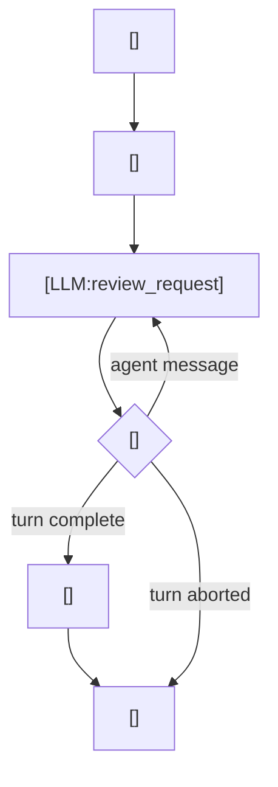

---
prompts:
  skills:
    path: codex-rs/core/src/context/available_skills_instructions.rs
    description: "レビュー時に見えている skills の前提"
  review_rubric:
    path: codex-rs/prompts/templates/review/rubric.md
    description: "レビュー用サブエージェントへ渡す判断基準と出力 JSON 仕様"
    schema:
      findings:
        type: list
        description: "指摘の一覧。各要素は ReviewFinding の 1 件。"
        items:
          title:
            type: str
            description: "指摘の短い見出し"
          body:
            type: str
            description: "何が問題かを説明する本文"
          confidence_score:
            type: float
            description: "指摘の確信度"
          priority:
            type: int
            description: "P0 から P3 までの優先度。0 から 3 で表す。"
          code_location:
            type: object
            description: "指摘に対応するファイル位置"
            properties:
              absolute_file_path:
                type: str
                description: "対象ファイルの絶対パス"
              line_range:
                type: object
                description: "指摘に関係する行範囲"
                properties:
                  start:
                    type: int
                    description: "開始行"
                  end:
                    type: int
                    description: "終了行"
      overall_correctness:
        type: str
        description: "patch 全体が正しいかどうかの判定文字列"
      overall_explanation:
        type: str
        description: "overall_correctness の根拠説明"
      overall_confidence_score:
        type: float
        description: "レビュー結果全体に対する確信度"
commands:
  - name: review
    path: codex-rs/core/src/tasks/review.rs
    description: "/review でレビュー専用 sub-agent を立ち上げる"
  - name: implicit_review_exit
    path: codex-rs/core/src/tasks/review.rs
    description: "レビュー完了後に親セッションへ結果を戻す"
call_points:
  - path: codex-rs/core/src/tasks/review.rs
    line: 96
    description: "レビュー用サブ会話を立ち上げる"
  - path: codex-rs/core/src/tasks/review.rs
    line: 116
    description: "REVIEW_PROMPT を sub-agent の base_instructions に入れる"
  - path: codex-rs/core/src/tasks/review.rs
    line: 213
    description: "レビュー結果を成功 / 中断 XML として親へ戻す"
---

# レビュー

このワークフローは、レビュー専用の sub-agent turn を立てて、まず diff と制約を集め、その上でレビュー用 prompt を LLM サーバーへ送ってコード変更を判断させる。親セッションの通常会話から切り離してレビュー作業を進める。

## 使われる場面

- `/review` を実行したとき
- コード変更の差分レビューを依頼したとき
- 人間向け findings をレビュー専用の LLM でまとめたいとき

## 入出力

- 入力
  - レビュー対象の diff / commit / branch / custom instructions
  - 親セッションの設定
- 出力
  - レビュー結果の要約
  - 親セッションに戻す `ExitedReviewMode`
  - 成功または中断を示す出口文

## 全体像



この図は、review turn の中で diff と制約を先に集め、`REVIEW_PROMPT` を材料化した request を LLM サーバーへ送り、イベントを回しながらレビュー結果と終了文を返す流れを示す。

## プロンプト要約

この処理では、レビュー役に必要な判断基準を materialize して、最後に出口文へつなげる。

### `skills`

- 見えている skills を前提に、関連 skill を参照できる状態にする。
- 必要なら関連文脈を参照して判断材料にする。

### `review_rubric`

- review guidelines として、accuracy / performance / security / maintainability に効く bug を見つけることを求める。
- findings の数え方、コメントの書き方、priority の付け方、JSON output schema を定義する。
- 出力は `ReviewOutputEvent` に対応する JSON で、`findings` と overall 判定を含める。

## プロンプトの工夫

### `REVIEW_PROMPT`

- レビュアーが守るべきルールを明示する。
- 何をレビューするか、どう findings を返すかを固定する。
- priority 付きの finding を JSON で返すこと、overall correctness verdict を出すことを含める。
- 実装上は `ReviewOutputEvent` として parse される前提なので、JSON の形を崩さない。

### 成功 / 中断の出口

- 成功時は findings をまとめた XML を作る。
- 中断時は「/review をやり直して」と案内する最小文にする。

## Python 疑似コード

```python
def run_review_turn(workspace, config, review_turn_context):
    prompt_context = build_review_prompt_context(config, review_turn_context)
    prompt = build_prompt(prompt_context, workspace.agents_md, review_turn_context, config)
    result = call_llm(prompt=prompt)

    if result.stream_error:
        return update_review_exit(interrupted=True)

    event_stream = open_review_event_stream(result)
    review_output = None
    while True:
        event = event_stream.recv()
        if event is None:
            break

        if event.is_turn_complete():
            review_output = parse_review_output_event(event.last_agent_message)
            break

        if event.is_turn_aborted():
            break

        update_review_turn_history(workspace, review_turn_context, event)

    if review_output is None:
        return update_review_exit(interrupted=True)
    return update_review_exit(interrupted=False, review_output=review_output)
```

## 再実装の要点

1. レビューは通常会話と分離した sub-agent にする。
1. 返答は構造化されたレビュー結果として扱い、失敗時だけテキスト fallback を持つ。
1. 途中キャンセルでも親側の状態遷移を壊さない。
1. レビュー用に許可する機能を最小化する。
1. sub-agent のイベント処理は完了まで回し続ける。
